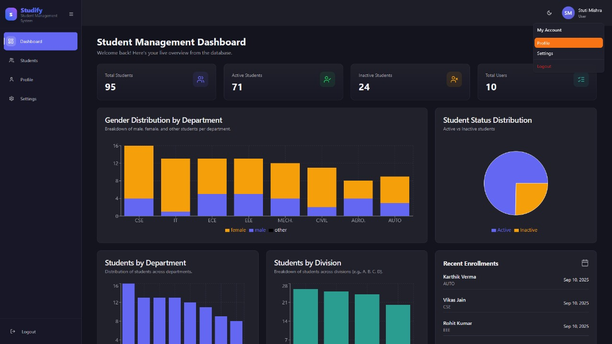
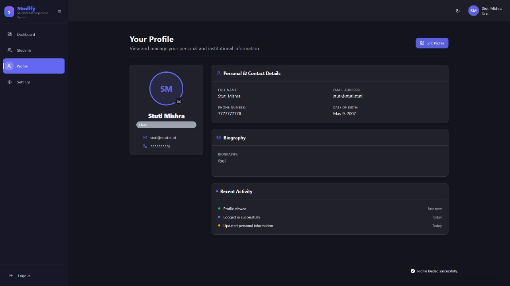
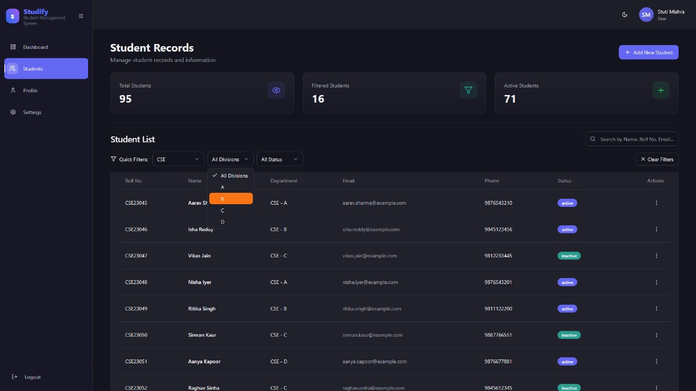
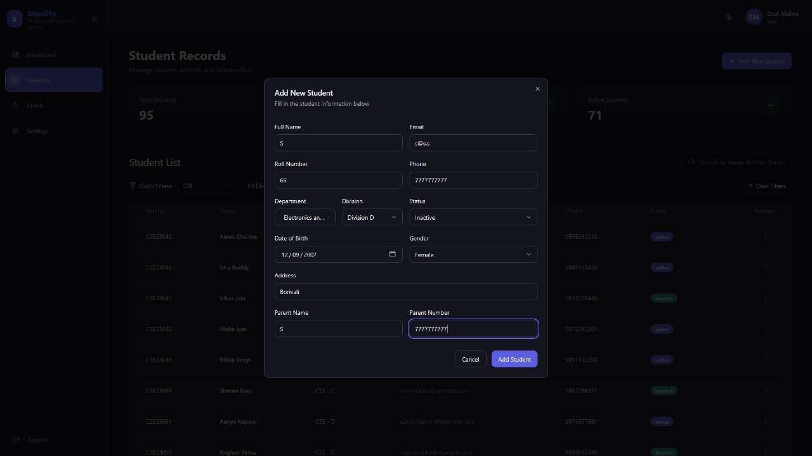
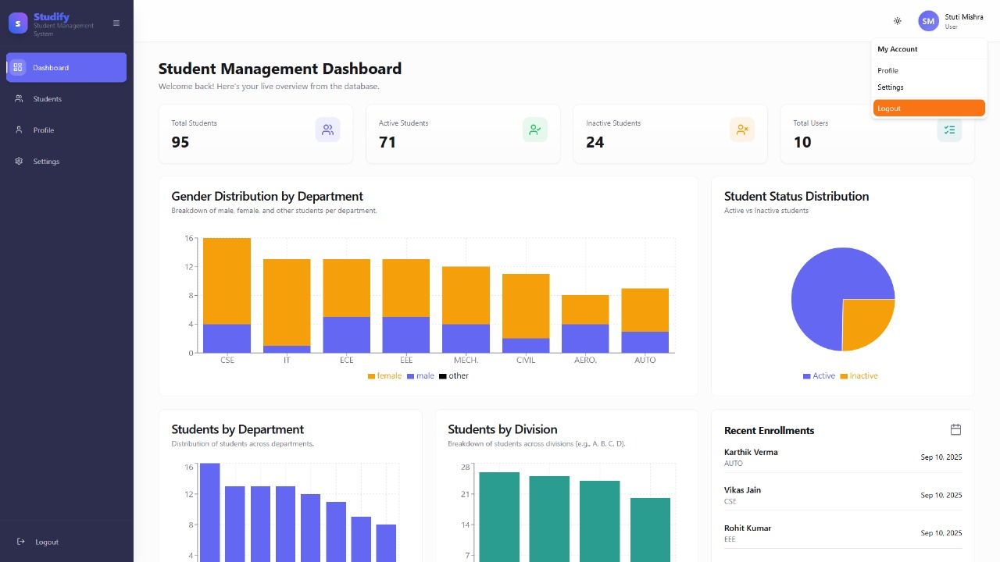
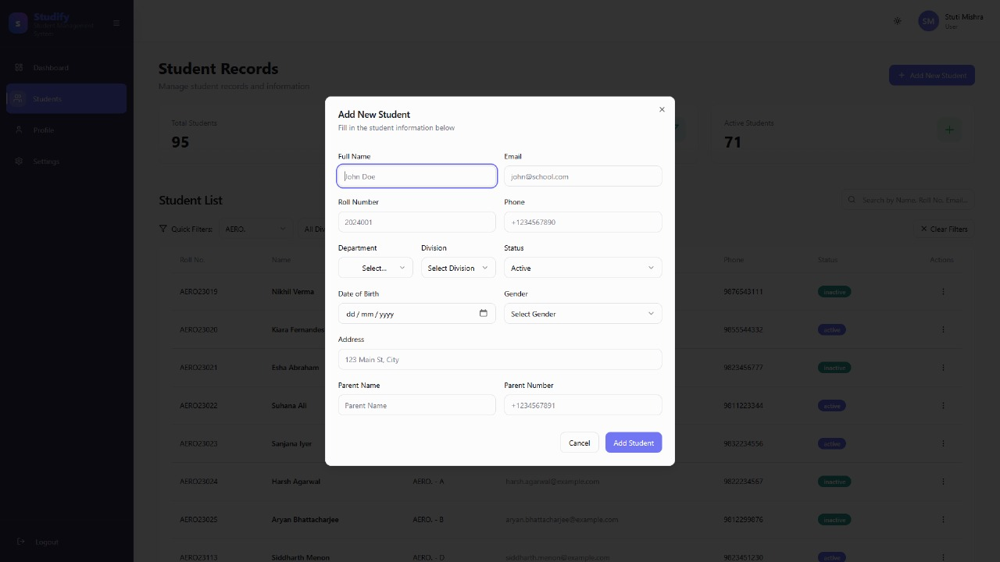
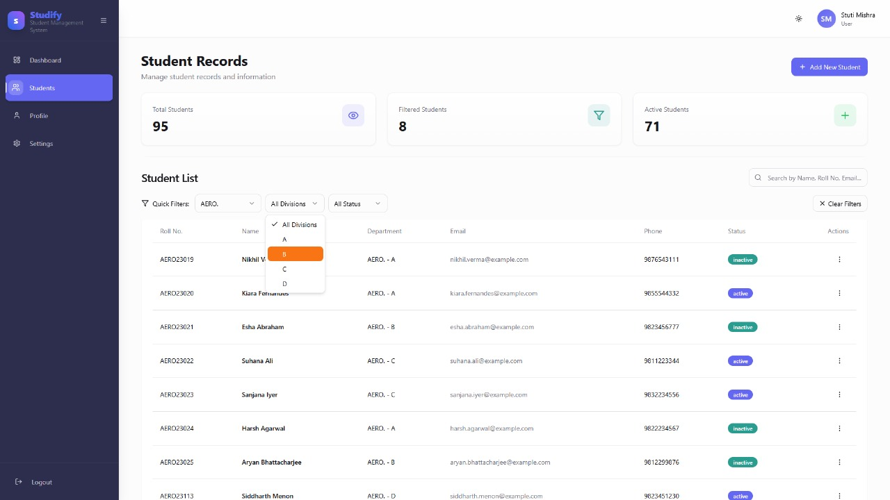
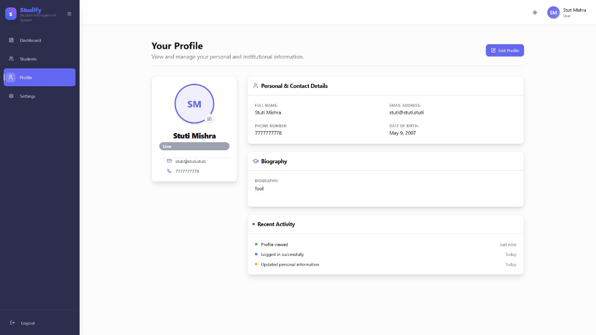
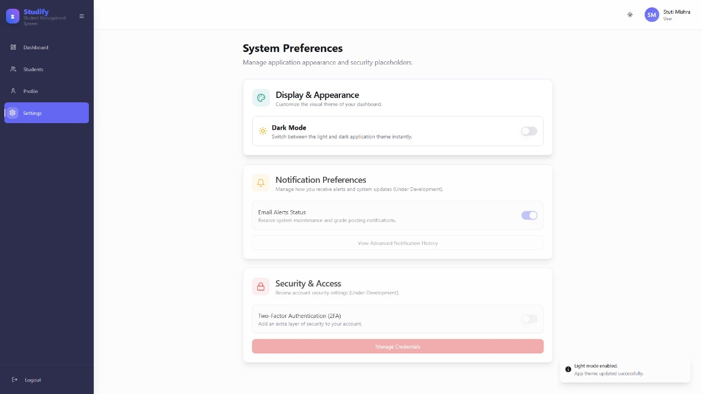

# studify

A full-stack student management platform built with a React frontend and a Spring Boot REST API. It handles user authentication, CRUD operations for student records, and features an interactive dashboard for data visualization, all backed by a TiDB (MySQL) cloud database but you can execute it with your local MySQL instance too.

## stack 

react (vite), spring boot, tidb (mysql), java

## deployment

wake this up first please!!! render [https://studify-hq66.onrender.com](https://studify-hq66.onrender.com)

after it's up n running netlify [https://stu-studify.netlify.app](https://stu-studify.netlify.app)

you don't need the tidb link!

## project structure

### backend
*   **controllers**: handles auth, dashboard stats, and student/user CRUD operations.
*   **entities**: jpa models for student and user data.
*   **repositories**: spring data jpa interfaces for tidb communication.
*   **resources**: managed via application.properties for cloud database integration.

### frontend
*   **pages**: dedicated views for dashboard, student management, profile, and settings.
*   **components**: reusable ui components and layout structures (sidebar/navbar).
*   **utils**: centralized api handling with environment variable support for seamless deployment.

## o/p demo ss

